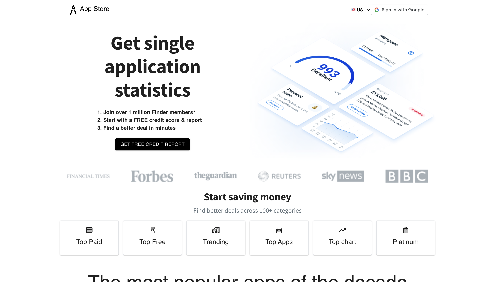

## App Store 
[Link to DEMO!](https://app-store-info.netlify.app)

It is fully functional website and showing real data about last minute application updates and news from RapidApi. In this website you can securly login with Google and translate entire page to Spanish language(can be add more languages). Near feature I am planing to add new functinality such as get individual application details and routing to dedicated page. 

## Stacks
`React` `Google Auth` `i18n` `jwt-decode` `Material UI` `styled-components`
